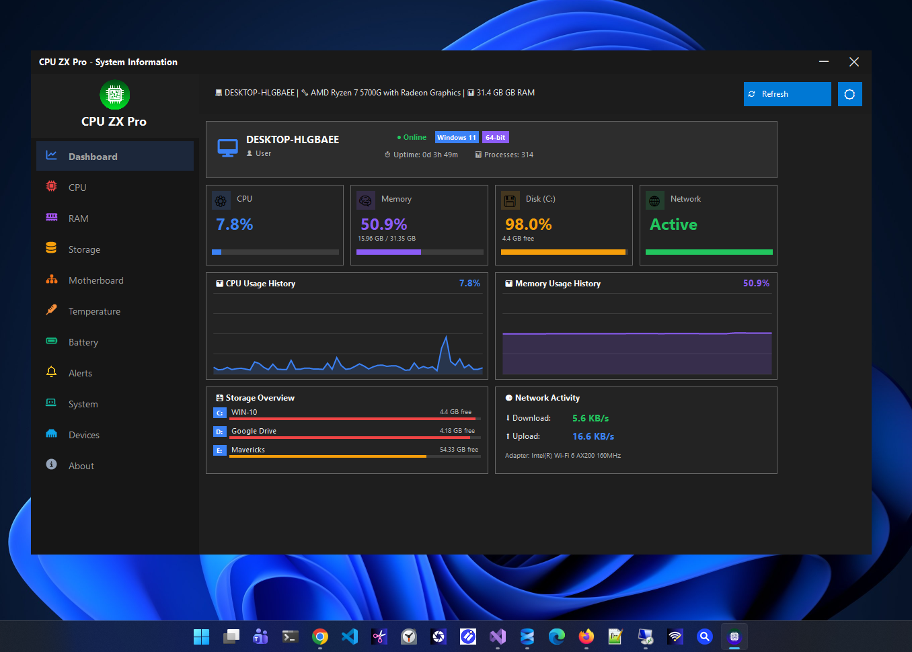
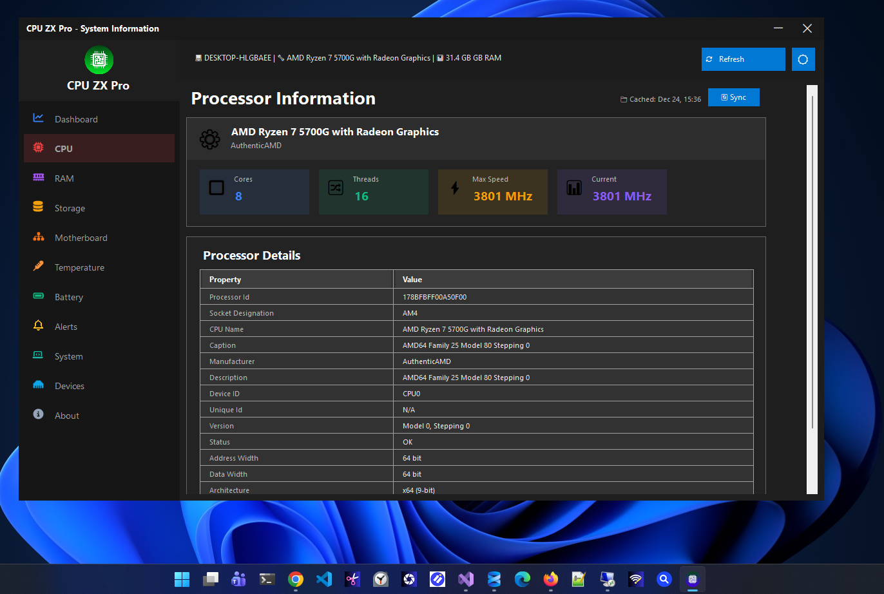
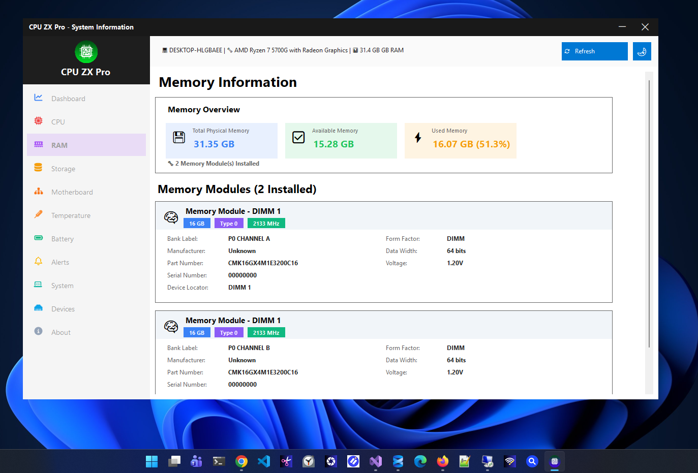
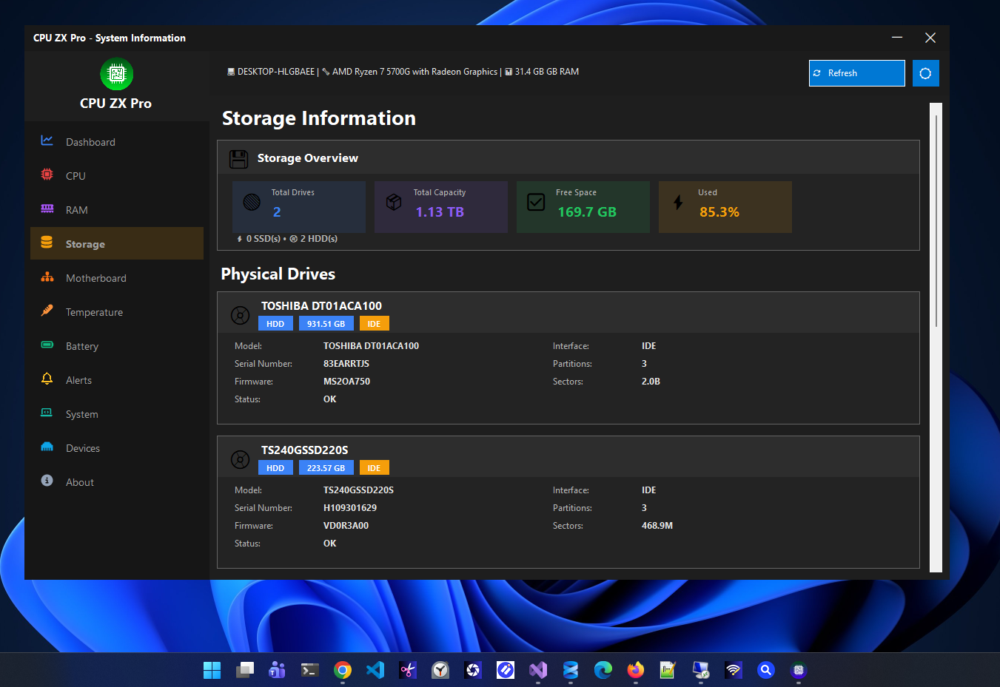
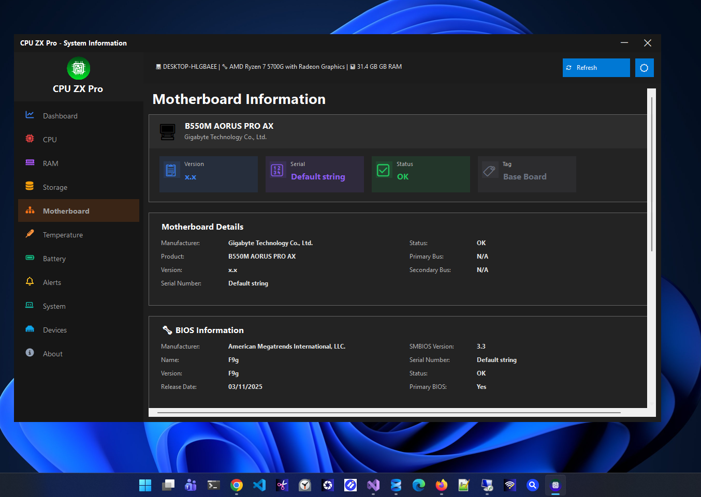
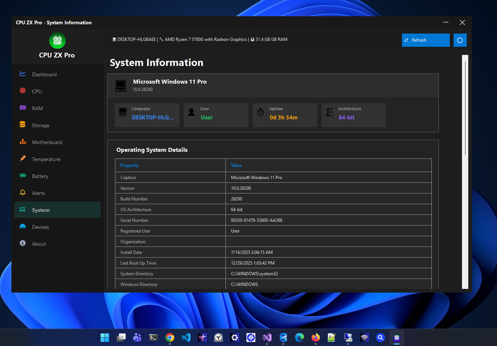
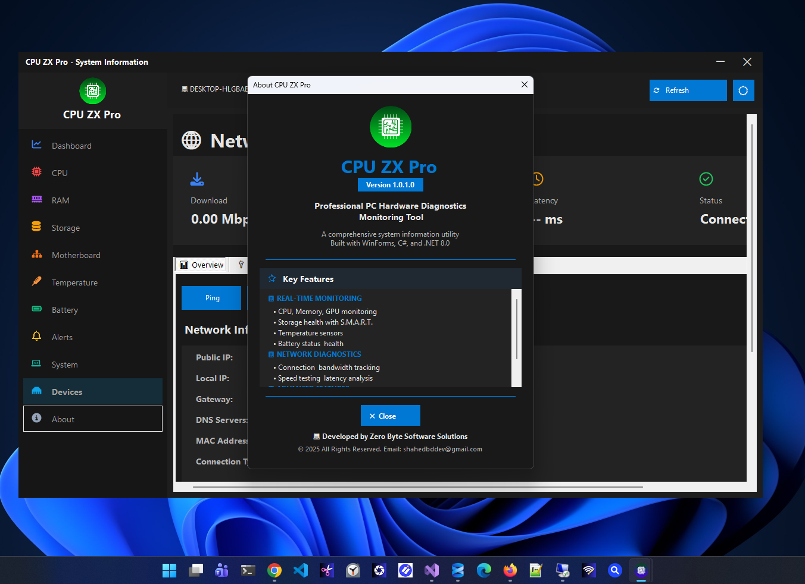

# CPU ZX Pro

### Professional Windows Hardware Monitoring & Diagnostics

Modern, lightweight, privacy-focused PC monitoring software built with **C#**, **.NET 8**, and **Windows Forms**.

---

# Overview

CPU ZX Pro is a professional Windows hardware monitoring and diagnostics application that provides real-time insights into your computer's performance.

Designed for developers, gamers, IT professionals, system administrators, and PC enthusiasts, CPU ZX Pro delivers fast, accurate, and lightweight monitoring while maintaining complete user privacy.

Unlike many hardware monitoring tools, CPU ZX Pro is built with a modern Windows UI and focuses on simplicity, speed, and efficiency.

---

# Features

## 📊 Dashboard

- Live CPU Usage
- Memory Usage
- Storage Usage
- Network Status
- CPU History Graph
- Memory History Graph
- Storage Overview
- Network Activity
- Windows Version
- Uptime
- Process Counter

---

## 🖥 CPU

- Processor Details
- Core Information
- Threads
- Clock Speed
- Architecture
- Cache Information
- Live CPU Usage

---

## 🎮 GPU

- GPU Information
- Graphics Adapter
- Dedicated Memory
- Shared Memory
- Driver Information
- Live GPU Details

---

## 💾 RAM

- Installed Memory
- Available Memory
- Used Memory
- Memory Speed
- Memory Type
- Manufacturer
- Usage Percentage

---

## 💽 Storage

- HDD
- SSD
- NVMe
- Capacity
- Free Space
- SMART Information
- Drive Health
- File System

---

## 🖥 Motherboard

- Manufacturer
- Model
- BIOS Version
- BIOS Date
- Chipset
- Baseboard Information

---

## 🌡 Temperature

Monitor available hardware sensors including:

- CPU Temperature
- Motherboard Temperature
- Storage Temperature

---

## 🔋 Battery

Laptop battery monitoring

- Battery Health
- Charge Level
- Wear Level
- Capacity
- Remaining Time

---

## 🔔 Alerts

Create custom alerts for

- High CPU Usage
- High Memory Usage
- High Temperature
- Low Storage Space

---

## 🖥 System

Complete Windows system information

- Windows Version
- Architecture
- Computer Name
- User
- Uptime
- Installed Hardware

---

## 🌐 IP Address

- Local IPv4
- IPv6
- MAC Address
- Gateway
- Adapter Details

---

## ℹ About

- Application Information
- Version
- Developer
- License
- Product Website

---

# Screenshots

## Dashboard

---

## CPU Information

---

## GPU Information

---

## Memory Information

---

## Storage Information

---

## Temperature Monitoring

---

## Battery Information

---

## System Information

---

## IP Address

---

# Built With

- C#
- .NET 8
- Windows Forms
- WMI
- Performance Counters
- Windows APIs

---

# System Requirements

| Requirement | Value |
|-------------|-------|
| OS | Windows 10 |
| OS | Windows 11 |
| Architecture | x64 |
| RAM | 4 GB Minimum |
| Storage | 100 MB |

---

# Privacy

CPU ZX Pro respects your privacy.

✅ No telemetry

✅ No advertising

✅ No user tracking

✅ No cloud dependency

✅ No personal data collection

✅ Offline-first application

---

# Roadmap

Upcoming features include:

- Performance Benchmark
- GPU Sensor Improvements
- Historical Performance Database
- PDF Report Export
- CSV Export
- JSON Export
- Process Manager
- Fan Speed Monitoring
- System Tray Widget
- AI Hardware Health Analysis

---

# Download

### Microsoft Store

https://apps.microsoft.com/detail/9N5RXJCZB734

### Product Website

https://zerobytebd.com/cpuzxpro

---

# Developer

**Zero Byte Software Solutions**

Website

https://zerobytebd.com

---

### ⭐ If you like CPU ZX Pro, please star the repository!

Made with ❤️ using C# and .NET

