

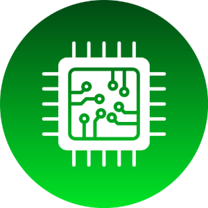

# CPU ZX Pro

**Professional Hardware Monitoring & Diagnostics for Windows**

*Real-time. Lightweight. Privacy-first.*

 

&nbsp;

  

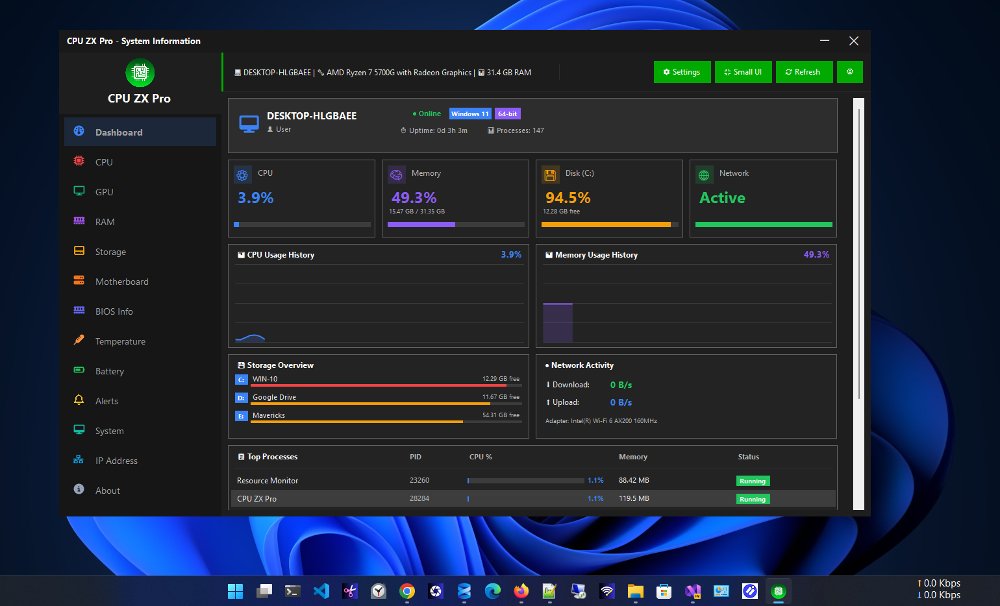

---

## 📋 Overview

**CPU ZX Pro** is a professional-grade hardware monitoring and diagnostics tool built exclusively for **Windows 10 and Windows 11**.

It delivers real-time visibility into every critical component of your PC — CPU, GPU, RAM, storage, motherboard, temperatures, battery, and network — all through a fast, modern interface that respects your privacy.

> **Zero telemetry. Zero cloud dependency. Zero compromise.**  
> Everything runs locally on your machine, always.

Designed for **developers, gamers, IT professionals, system administrators, and PC enthusiasts** who demand accurate data without the bloat.

---

## ✨ What Makes CPU ZX Pro Different

| | CPU ZX Pro | Typical Monitoring Tools |
|---|---|---|
| **UI Design** | Modern Windows 11-style UI | Dated or cluttered interfaces |
| **Privacy** | Zero telemetry, fully offline | Often phone home |
| **Performance** | Minimal resource footprint | Can be heavy on CPU/RAM |
| **Platform** | Microsoft Store — trusted delivery | Third-party installers |
| **Theme Support** | Light & Dark mode | Usually one theme |

---

## 🖥️ Screenshots

<strong>📸 Click to expand all screenshots</strong>

 

**Dashboard — Light Mode**

**Dashboard — Dark Mode**
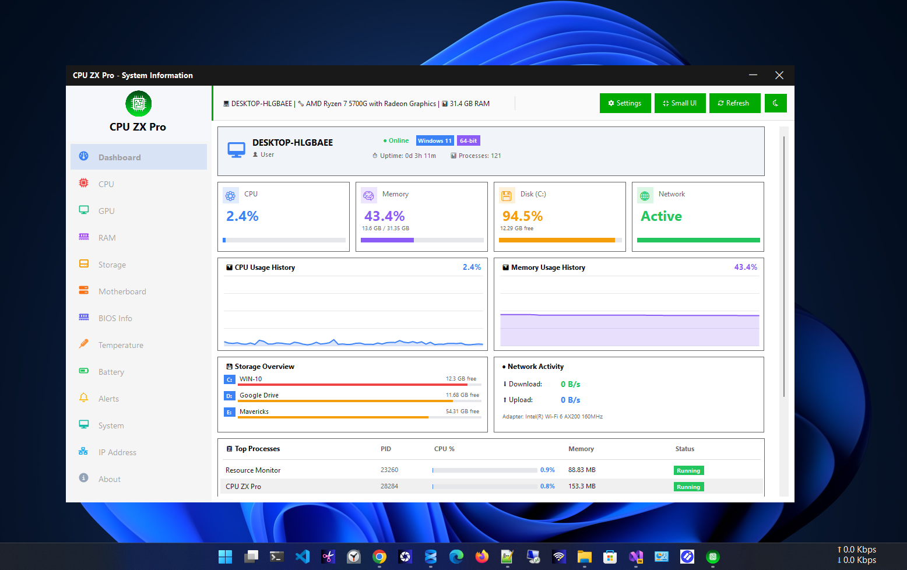

**CPU Information**
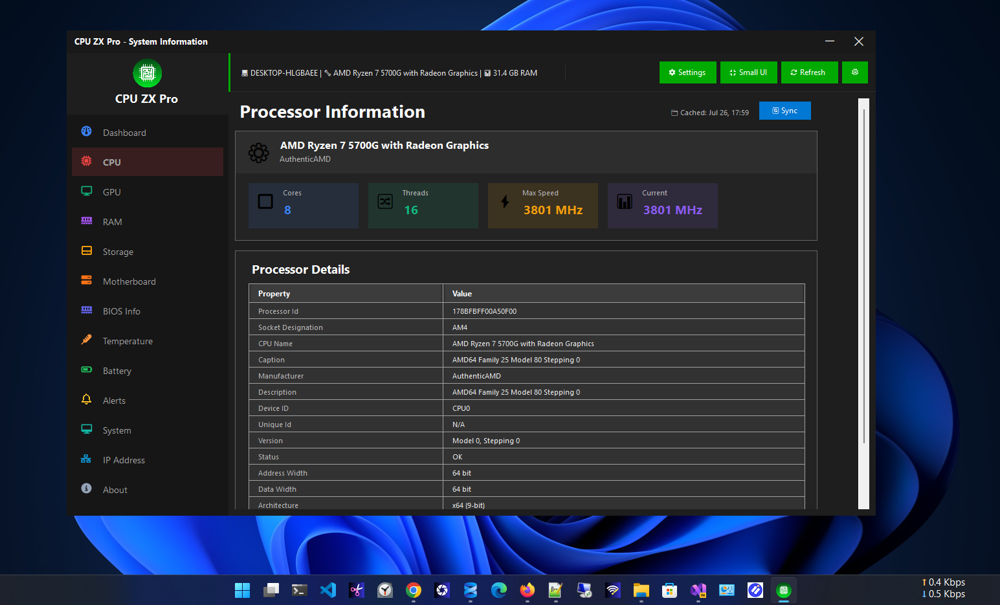

**GPU Information**
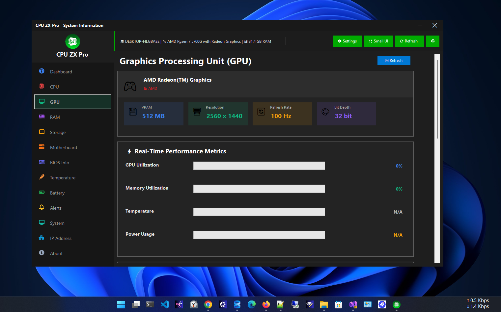

**Memory (RAM)**

**Storage**
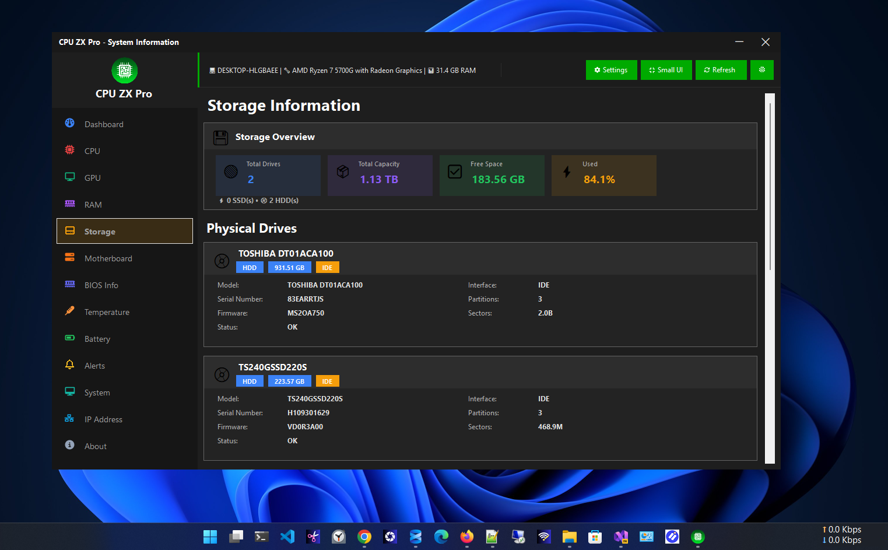

**Motherboard**
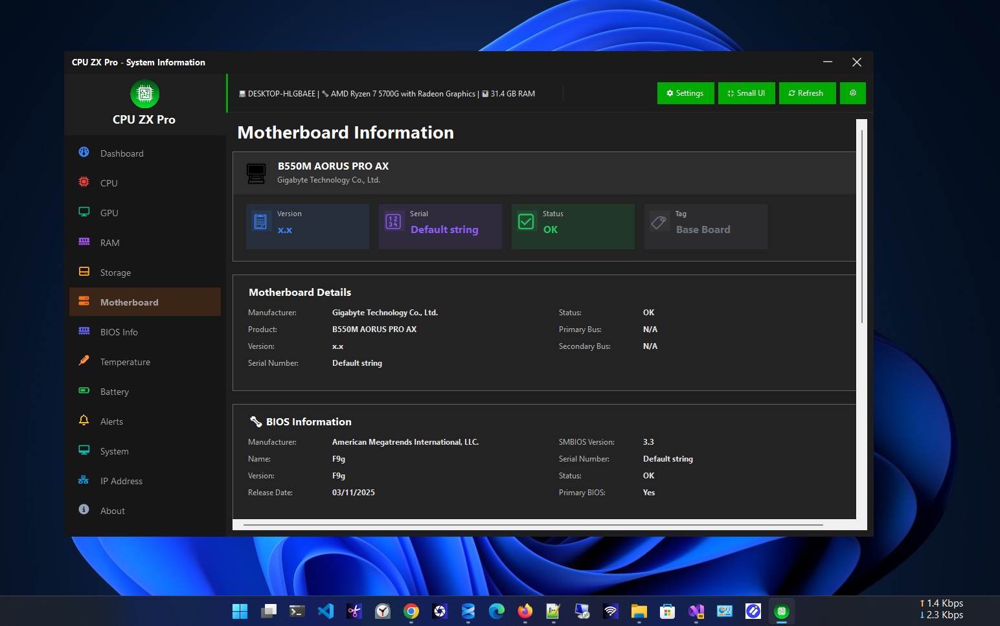

**BIOS Information**

**Temperature Monitoring**
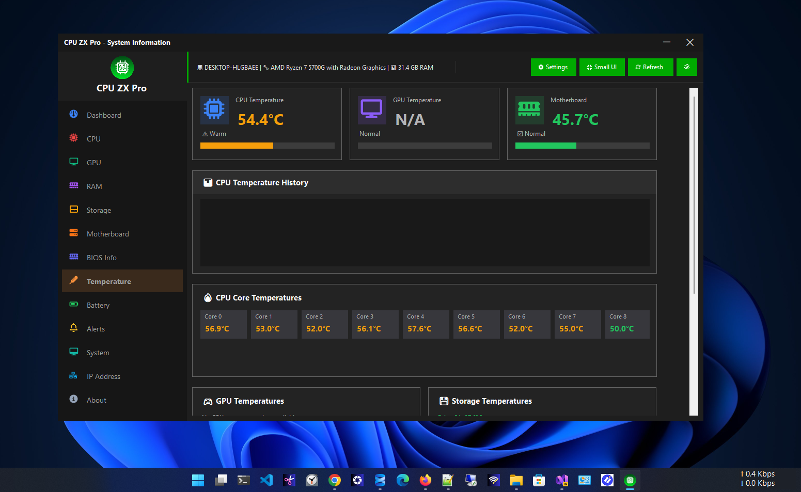

**Battery Health**
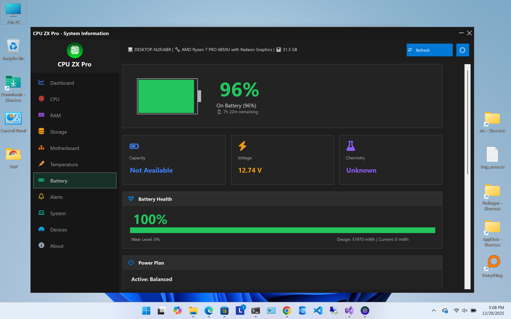

**Alerts**
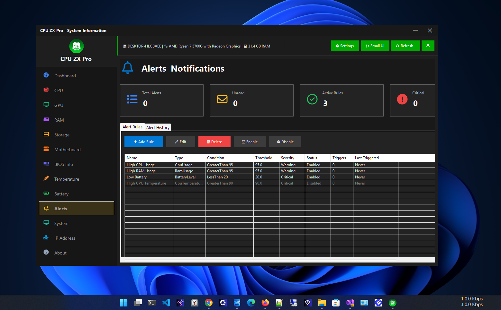

**System Information**
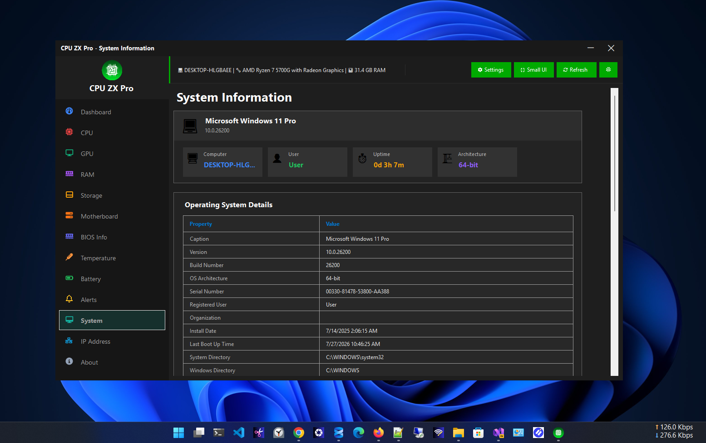

**IP Address & Network**
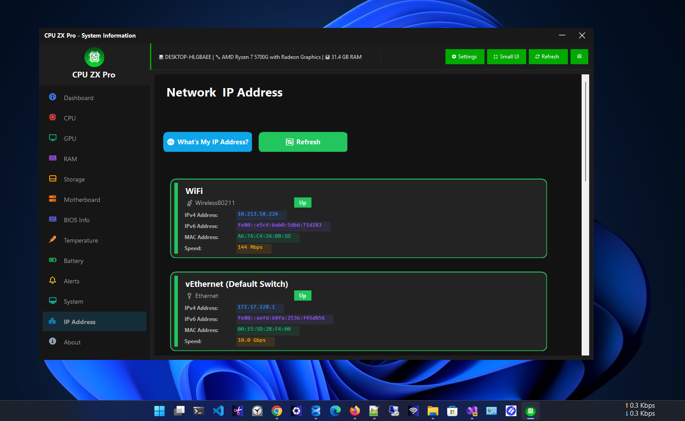

**About**
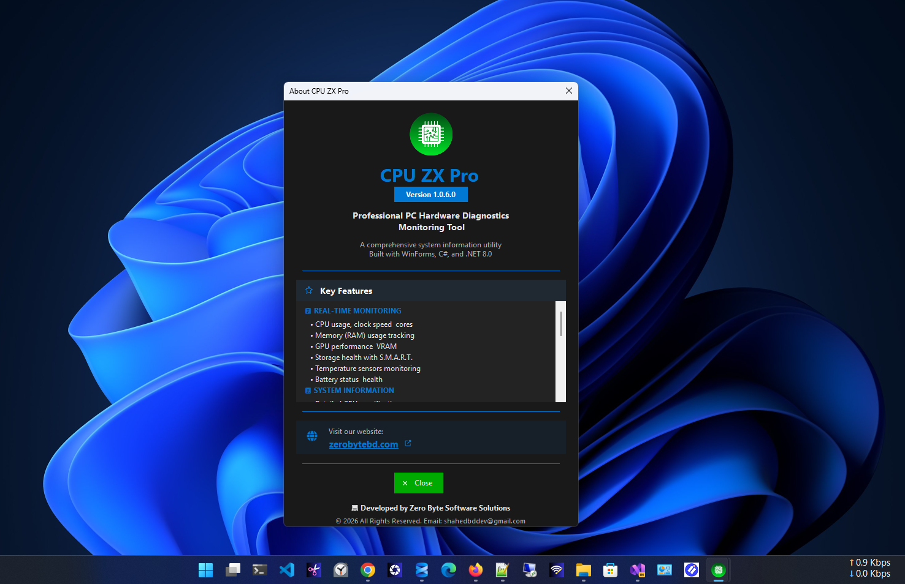

---

## 🧭 Modules at a Glance

CPU ZX Pro is organized into **12 focused monitoring modules**, accessible from the sidebar:

| Module | What It Shows |
|--------|---------------|
| 📊 **Dashboard** | Live system overview — CPU, RAM, storage, network, uptime, and process count |
| 🖥️ **CPU** | Processor name, cores, threads, clock speeds, cache, and per-core usage |
| 🎮 **GPU** | GPU model, VRAM, driver version, usage, and display adapter details |
| 💾 **RAM** | Total/used/available memory, speed, type, manufacturer, and slot info |
| 💿 **Storage** | HDD/SSD/NVMe detection, capacity, health, SMART data, and temperatures |
| 🖥️ **Motherboard** | Manufacturer, model, chipset, BIOS version, date, and serial number |
| 🌡️ **Temperature** | Real-time CPU, motherboard, and storage sensor readings |
| 🔋 **Battery** | Charge level, health, wear, estimated runtime, and charging status |
| 🔔 **Alerts** | Configurable thresholds for CPU, RAM, temperature, and storage warnings |
| 🖥️ **System** | Windows edition, build, architecture, user, boot time, and uptime |
| 🌐 **IP Address** | IPv4, IPv6, MAC address, gateway, DNS, and adapter details |
| ℹ️ **About** | App version, license, developer, and product information |

---

## 📊 Dashboard

The Dashboard is your command center — a live, unified view of your entire system at a glance.

- **CPU & Memory** usage with live history graphs
- **Storage** overview across all drives
- **Network** activity with real-time statistics
- **System summary** — uptime, process count, Windows version

---

## 🖥️ CPU

Deep-dive into your processor with live diagnostics.

- Processor name, manufacturer & architecture
- Core count, logical threads & cache (L1 / L2 / L3)
- Current clock speed vs. base clock
- Live total usage & per-core breakdown

---

## 🎮 GPU

Full visibility into your graphics hardware.

- GPU model, manufacturer & driver version
- Dedicated & shared VRAM
- Live GPU utilization
- Display adapter details

---

## 💾 RAM

Complete memory monitoring and hardware specs.

- Total, used & available memory
- Memory type, speed & slot configuration
- Manufacturer details & usage percentage

---

## 💿 Storage

Monitor every drive in your system — all in one place.

- Detects HDD, SSD, and NVMe drives automatically
- Capacity, used space & free space
- Drive health status & SMART data
- Temperature support for compatible devices
- File system information

---

## 🖥️ Motherboard

Everything about your board and firmware.

- Manufacturer, model & chipset
- BIOS version, release date
- Serial number & baseboard details

---

## 🌡️ Temperature

Real-time thermal monitoring across your hardware.

- CPU temperature
- Motherboard temperature
- Storage drive temperature
- All available system sensors

---

## 🔋 Battery

Comprehensive battery diagnostics for laptop users.

- Current charge percentage & remaining capacity
- Battery health score & wear level
- Estimated runtime
- Charging status & active power source

---

## 🔔 Alerts

Stay ahead of performance issues with proactive notifications.

Configure custom thresholds for:

- 🔴 High CPU usage
- 🟠 High memory usage
- 🌡️ High temperature
- 💿 Low storage space

Alerts fire before your system becomes critical — not after.

---

## 🖥️ System

A complete snapshot of your Windows environment.

- Computer name, Windows edition & build number
- System architecture & logged-in user
- Boot time, uptime & running process count

---

## 🌐 IP Address

Full network configuration at a glance.

- Local IPv4 & IPv6 addresses
- MAC address & default gateway
- DNS server details & adapter information
- Live network status

---

## 🔒 Privacy

CPU ZX Pro is built on a **privacy-first architecture**. Your hardware data never leaves your machine.

| Policy | Status |
|--------|--------|
| Telemetry | ✅ None |
| Advertising | ✅ None |
| User Tracking | ✅ None |
| Cloud Dependency | ✅ None |
| Personal Data Collection | ✅ None |
| Offline Operation | ✅ Fully offline |

---

## 🔧 Built With

| Technology | Role |
|------------|------|
| **C#** | Primary programming language |
| **.NET 8** | Application framework |
| **Windows Forms** | UI framework |
| **WMI** | Hardware data access layer |
| **Performance Counters** | Real-time system metrics |
| **Windows APIs** | Deep system-level integration |

---

## 💻 System Requirements

| Requirement | Value |
|-------------|-------|
| **OS** | Windows 10 / Windows 11 |
| **Architecture** | x64 |
| **RAM** | 4 GB minimum |
| **Storage** | ~100 MB |
| **Internet** | Not required |

---

## 🗺️ Roadmap

Features actively under consideration for future releases:

- [ ] 📈 Performance Benchmarking
- [ ] 📄 Report Export — PDF / CSV / JSON
- [ ] 🗃️ Historical Performance Database
- [ ] ⚙️ Process Manager
- [ ] 🌀 Fan Speed Monitoring
- [ ] 🎮 Advanced GPU Sensor Support
- [ ] 📡 Network Usage History
- [ ] 🖥️ System Tray Mini Dashboard
- [ ] 🤖 AI-Based Hardware Health Analysis

---

## 📥 Download

&nbsp;

---

## 👨‍💻 Developer

**Zero Byte Software Solutions**

🌐 [zerobytebd.com](https://zerobytebd.com)

---

⭐ **If CPU ZX Pro helps you, please star this repository — it means a lot!**

Made with ❤️ using C# and .NET 8 on Windows

