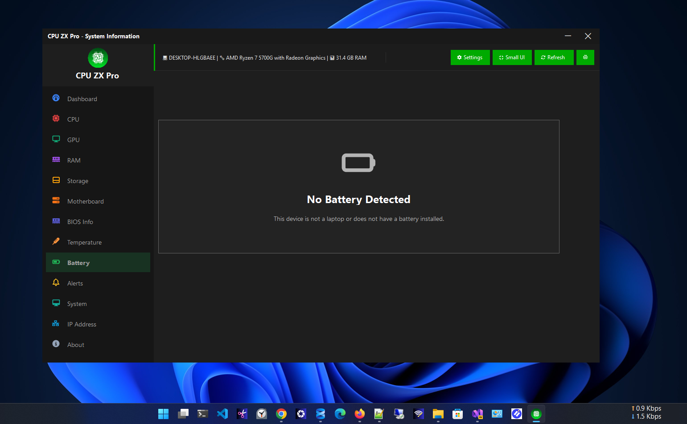

# CPU ZX Pro

### Professional Windows Hardware Monitoring & Diagnostics

Modern, lightweight, privacy-focused PC monitoring software built with **C#**, **.NET 8**, and **Windows Forms**.

  

  
  &nbsp;
  

---

## 📋 Overview

**CPU ZX Pro** is a professional hardware monitoring and diagnostics application for **Windows 10 and Windows 11**.

It provides real-time insights into CPU, GPU, memory, storage, motherboard, temperatures, battery health, and network activity — all through a modern, lightweight interface.

Designed for **developers, gamers, IT professionals, system administrators, and PC enthusiasts**, CPU ZX Pro delivers fast, accurate monitoring while maintaining complete user privacy.

> Unlike many hardware monitoring tools, CPU ZX Pro features a clean modern Windows UI focused on simplicity, speed, and zero telemetry.

---

## ✨ Features

<table>
  <tr>
    <td>📊 Dashboard</td>
    <td>🖥️ CPU</td>
    <td>🎮 GPU</td>
    <td>💾 RAM</td>
  </tr>
  <tr>
    <td>💽 Storage</td>
    <td>🖥️ Motherboard</td>
    <td>🌡️ Temperature</td>
    <td>🔋 Battery</td>
  </tr>
  <tr>
    <td>🔔 Alerts</td>
    <td>🖥️ System</td>
    <td>🌐 IP Address</td>
    <td>ℹ️ About</td>
  </tr>
</table>

---

## 🧭 Navigation Modules

| Module | Description |
|--------|-------------|
| **Dashboard** | Real-time overview of system performance |
| **CPU** | Processor monitoring and detailed information |
| **GPU** | Graphics adapter information and monitoring |
| **RAM** | Memory monitoring and specifications |
| **Storage** | Disk usage, health, and drive information |
| **Motherboard** | Motherboard and BIOS details |
| **Temperature** | Hardware temperature sensor monitoring |
| **Battery** | Laptop battery health and statistics |
| **Alerts** | Configurable system performance alerts |
| **System** | Windows and installed hardware information |
| **IP Address** | Network configuration and IP details |
| **About** | Product and developer information |

---

## 📊 Dashboard

The Dashboard provides a live, at-a-glance overview of your entire system.

- Live CPU, Memory, Storage & Network usage
- CPU & Memory history graphs
- Storage overview panel
- Network activity statistics
- System summary, uptime & process count
- Windows version display

---

## 🖥️ CPU

Detailed processor diagnostics in real time.

- Processor name, manufacturer & architecture
- Core count & logical processor threads
- Current & base clock speed
- Cache information (L1 / L2 / L3)
- Live CPU usage & per-core statistics

---

## 🎮 GPU

Full visibility into your graphics hardware.

- GPU model & manufacturer
- Dedicated & shared memory
- Live GPU usage
- Driver version & display adapter details

---

## 💾 RAM

Complete memory monitoring and specifications.

- Total, used & available memory
- Memory speed & type
- Manufacturer & slot information
- Usage percentage

---

## 💽 Storage

Monitor all installed drives in one place.

- HDD / SSD / NVMe detection
- Capacity, free & used space
- Drive health & SMART information
- Temperature (on supported devices)
- File system information

---

## 🖥️ Motherboard

Full motherboard and firmware details.

- Manufacturer, model & chipset
- BIOS version & date
- Serial number & baseboard details

---

## 🌡️ Temperature

Real-time hardware sensor monitoring.

- CPU temperature
- Motherboard temperature
- Storage temperature
- Additional available sensors

---

## 🔋 Battery

Comprehensive battery health for laptop users.

- Charge percentage & remaining capacity
- Battery health & wear level
- Estimated runtime
- Charging status & power source

---

## 🔔 Alerts

Proactive notifications before performance becomes critical.

Configurable alerts for:

- High CPU usage
- High memory usage
- High temperature
- Low storage space

---

## 🖥️ System

Complete Windows system information at a glance.

- Computer name, Windows edition & build number
- System architecture & logged-in user
- Boot time, uptime & running processes

---

## 🌐 IP Address

Full network configuration details.

- Local IPv4 & IPv6 addresses
- MAC address & gateway
- DNS information & adapter details
- Network status

---

## 🖼️ Screenshots

### Dashboard

### Dashboard (Dark)

### CPU Information

### GPU Information

### Memory Information

### Storage Information

### Motherboard Information

### BIOS Information

### Temperature Monitoring

### Battery Information

### Battery (No Battery Installed)

### Alerts

### System Information

### Public IP Address

### About

---

## 🔧 Built With

| Technology | Role |
|------------|------|
| **C#** | Primary language |
| **.NET 8** | Application framework |
| **Windows Forms** | UI framework |
| **WMI** | Hardware data access |
| **Performance Counters** | Real-time metrics |
| **Windows APIs** | System-level integration |

---

## 💻 System Requirements

| Requirement | Value |
|-------------|-------|
| Operating System | Windows 10 / Windows 11 |
| Architecture | x64 |
| RAM | 4 GB minimum |
| Storage | 100 MB |
| Internet | Not required |

---

## 🔒 Privacy

CPU ZX Pro is built with a **privacy-first** architecture. Your data never leaves your machine.

| Policy | Status |
|--------|--------|
| Telemetry | ✅ None |
| Advertising | ✅ None |
| User Tracking | ✅ None |
| Cloud Dependency | ✅ None |
| Personal Data Collection | ✅ None |
| Offline Operation | ✅ Fully offline |

---

## 🗺️ Roadmap

Upcoming features under active consideration:

- [ ] Performance Benchmarking
- [ ] PDF / CSV / JSON Report Export
- [ ] Historical Performance Database
- [ ] Process Manager
- [ ] Fan Speed Monitoring
- [ ] Advanced GPU Sensor Support
- [ ] Network Usage History
- [ ] System Tray Mini Dashboard
- [ ] AI-Based Hardware Health Analysis

---

## 📥 Download

### Microsoft Store

### Product Website

---

## 👨‍💻 Developer

**Zero Byte Software Solutions**

🌐 [zerobytebd.com](https://zerobytebd.com)

---

### ⭐ If you find CPU ZX Pro useful, please star the repository!

Made with ❤️ using C# and .NET

